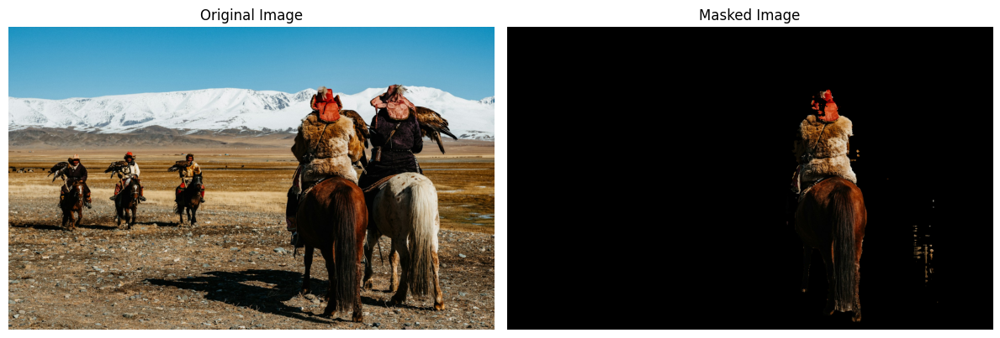
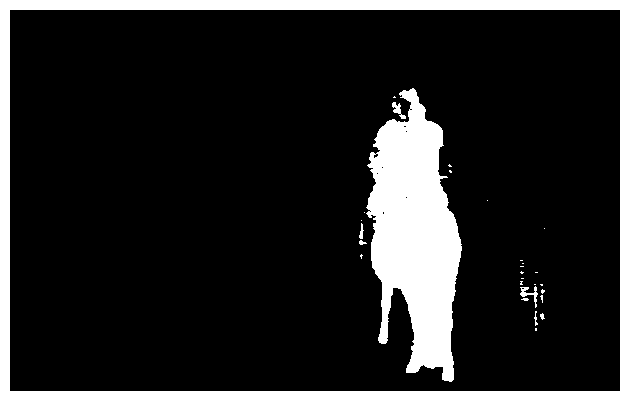
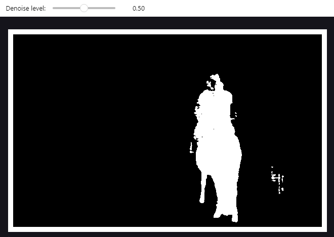
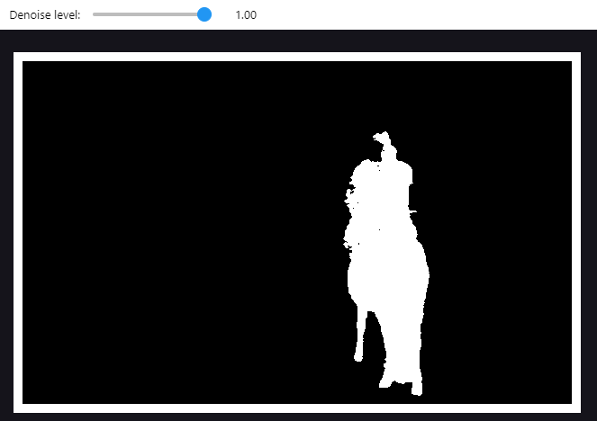

# auto denoising example

Auto denoising with ```MaskEditor.auto_denoise``` allows to remove small areas selected by SAM2 but that are not part of the subject of interest.

For example, this mask includes also part of the other horse:





## Denoising level = 0.5


## Denoising level = 1
As the denoise level increases, more small parts are removed from the mask. This, as seen with level = 1, can also produce unwanted results (half of the hat is removed from the mask). For a more precise selection, it is better to use ```MaskEditor.manual_edit```.



