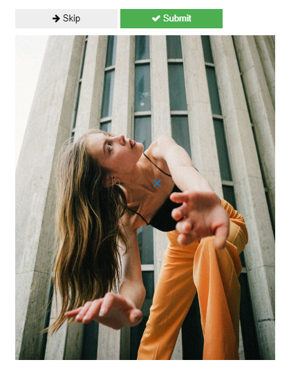
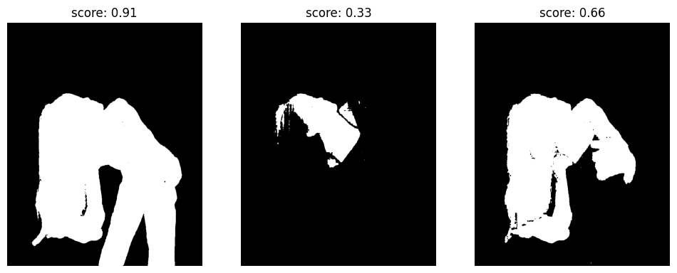
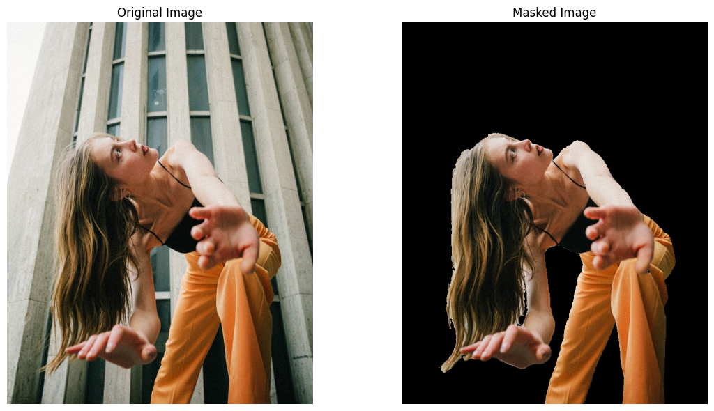
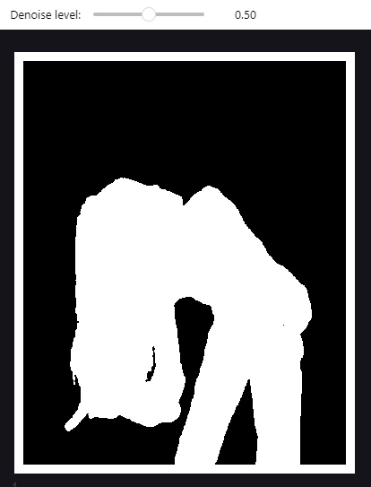
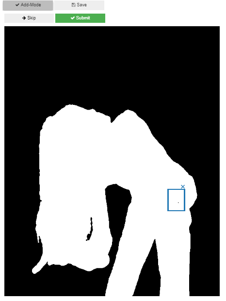
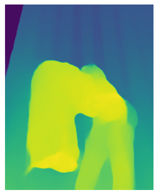
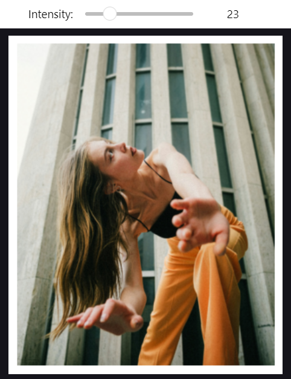
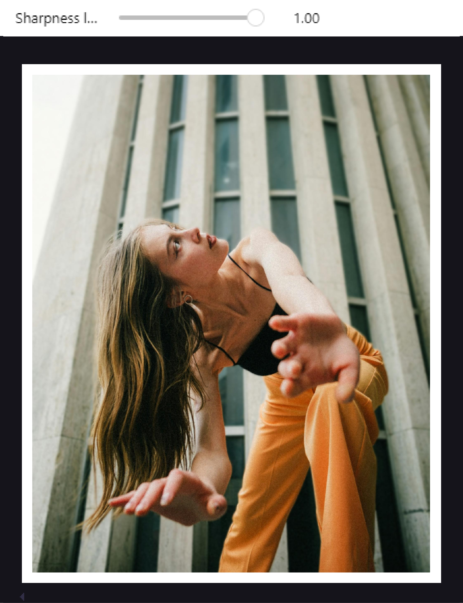

# selective blur tutorial

## Import image
The first step consists in selecting the image, by assigning its name and extension to the variable ```image_name```. 

By default the images will be searched in ```images``` folder .

```python
image_name = "model.jpg"
image_path = os.path.join("images/inputs", image_name)
```

## Mask

### Selection
```python
s = Segmenter(image_path)
s.select_from_image()
```

Select all the subjects that you want to segment by clicking on them (a blue cross will appear on them). Then click on "Submit".



Then, three candidate masks will appear (mask 0, 1 and 2), as the following:



You can choose the mask that you prefer by writing the number of your choice inside ```s.choose_mask()```. 

In this case we will select mask 0:

```python
s.choose_mask(0)
```

Now we can plot the original image and its masked version:

```python
show_image_and_mask(s.image_bgr, s.best_mask)
```



### Cleaning
In this case the mask is already pretty good, so no much cleaning is needed. However, when necessary two tools can be used.

The first one is ```auto_denoise```, which removes the areas masked by the model but that are not really related with the subject that we want to isolate. The denoised mask with the selected level is saved automatically to the editor object.

```python
editor = MaskEditor(s.best_mask)
editor.auto_denoise()
```


Manual edit is the second tool, which allows to manually select areas, by drawing rectangles on the image, that will be added or removed from the mask. In this case we are adding to the mask a small black point that have not been selected by the model. Add-Mode is active when its color is dark-grey, like in this case, if we click on it we switch to remove mode.

The edited mask is saved only when Save is clicked. "Submit" can be used to see a preview of the changes, which will be saved only when "Save" is clicked. 

```python
editor.manual_edit()
```



## Blur
### Generate depth map

When the image is loaded to the Selector class MiDaS model produces a depth map of it, that can be viewed with ```show_depth_map()```.
```python
sel = Selector(image_path, model="DPT_Hybrid", mask=editor.mask)
sel.show_depth_map()
```


### Apply blur
The function ```select_kernel_size``` allows to select interactively the desired level of blur (for more details see the function documentation).



## Final image
The final step consists in blending the blurred image with the masked subject. When the maximum sharpness level is chosen, as in this case, the masked subject will not be blurred.

```python
b = Blender(mask=editor.mask, original_image=sel.image, image_blurred=sel.image_blurred)
b.blend()
```

